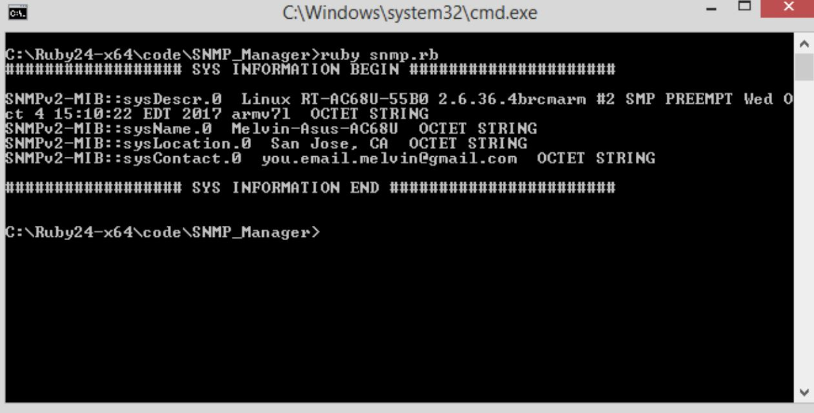
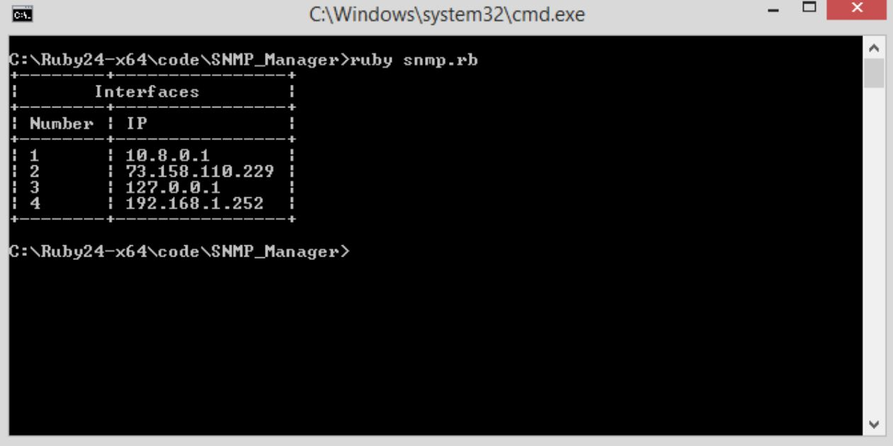
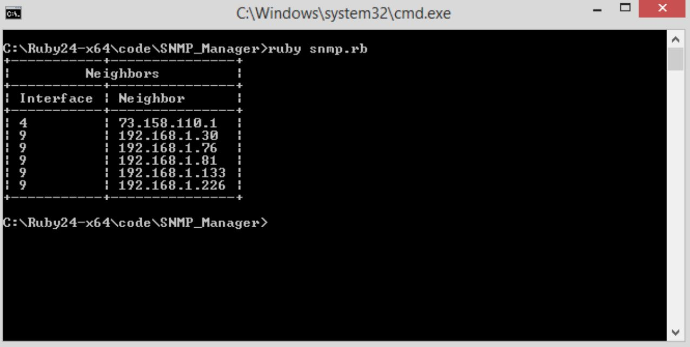
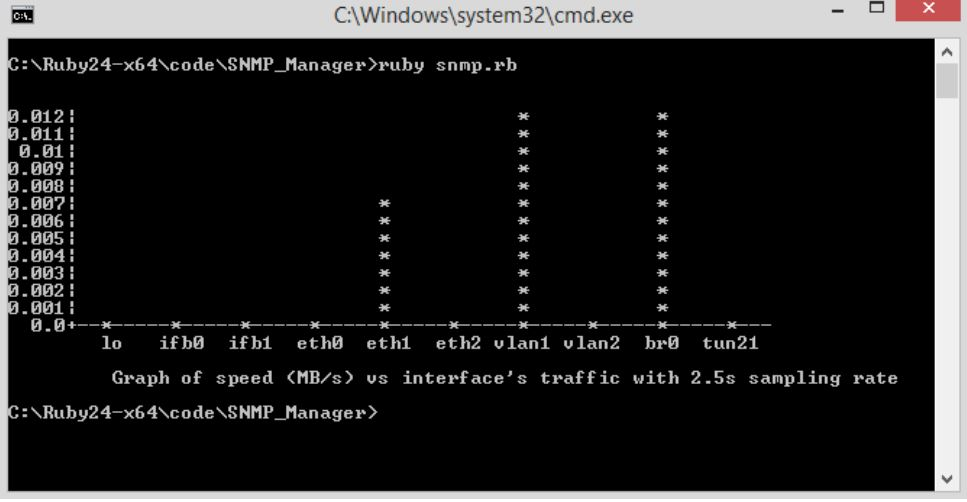
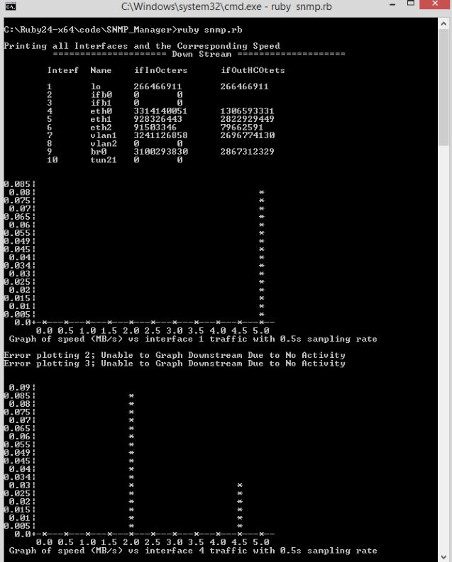

# Ruby SNMP Manager

This repository contains a Ruby SNMP Manager script. It is an 4 weeks long academic project to allow student to familiarize with SNMP. It is written based on SNMP V2. 

### Feature and Screenshot
- Get system information

  

- List all interface

  

- List all neighbor

  

- Plot traffic 

  

- Plot each interface's traffic

  

### Requirement
- Ruby 2.2+ (Tested on Ruby 2.4.1)

### Gemfile
- [`ascii_charts`](https://rubygems.org/gems/ascii_charts/versions/0.9.1)
- [`snmp`](https://github.com/hallidave/ruby-snmp)
- [`benchmark`](https://ruby-doc.org/stdlib-1.9.3/libdoc/benchmark/rdoc/Benchmark.html)
- [`terminal-table`](https://github.com/tj/terminal-table)

### References
- [Ruby SNMP Documentation](https://github.com/hallidave/ruby-snmp)
- [SNMP OID](http://www.alvestrand.no/objectid/)